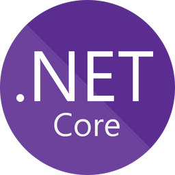

 

  

<h1 align="center">Hi!  My name is Abdullokhon.</h1>
<h3 align="center">✅ Full-Stack | Passion for Development 🔥</h3>

---

  
  &nbsp;&nbsp;&nbsp;
  

 

### 📌 About Me

💻 **I believe code is an art, and I aim to make it both beautiful and efficient.** Full-Stack Developer with a passion for clean architecture, process automation, and creating efficient solutions. In my free time, I experiment with game development and new technologies.

* 🌍  **I'm based in Khujand, Tajikistan.**
* 🚀  **I'm currently working on improving my Full-Stack development skills.** 🛠️
* 🧠  **I'm learning everything I can.**
* 🤝  **I'm open to collaborating on interesting Full-Stack projects.** 🌍
* ⚡  **I love writing clean and maintainable code.** ✨

---

### 💪 My Skills Set

<table><tr><td valign="top" width="40%">

### 🎨 Frontend

</td><td valign="top" width="40%">

### 🛠 Backend

</td><td valign="top" width="20%">

### 🧑‍💻 Editors

</td></tr></table>

---

### 📞 Connect with me

  
  
  
  
  
  

---

### 📊 GitHub Statistics

  " alt="GitHub Stats" />

---

### 🌐 Top Languages

  " alt="Top Languages" />

---

### 🏆 GitHub Trophies

  " alt="GitHub Trophies" />

---

### 💡 LeetCode Stats

  

---

### 🎧 Spotify Playing

  

---

### 🧑‍💻 About this profile
- This is a **custom GitHub profile** showcasing my work and **developer stats**. #GitHubProfile #DeveloperProfile #PersonalPortfolio

  

