 

  

<h1 align="center">
  Hi!
  
  I'm Abdullokhon, 17
</h1>

<h3 align="center">✅ Full-Stack Developer | Passion for Development 🔥</h3>

  
  

  

---

### 👨‍💻 About Me

💻 I believe code is an art, and I aim to make it both beautiful and efficient.  
Full-Stack Developer with a passion for clean architecture, process automation, and creating elegant solutions.  
In my free time, I experiment with game development and new technologies.

- 🌍  Based in **Khujand, Tajikistan**
- 🚀  Currently improving my **Full-Stack** skills
- 🔎  Always learning something new
- 🤝  Open to collaborating on exciting projects
- ✨  Love writing clean, scalable code

---

### 📬 Connect with Me

  
  
  
  
  
  
  

---

### 💼 Tech Stack

  <table>
    <tr>
      <td align="center">
        <b>🌠Web Technologies</b>  
        
        
        
         
        
        
        
        
      </td>
      <td align="center">
        <b>🧠 Logic & APIs</b>  
        
        
         
        
        
        
      </td>
      <td align="center">
        <b>⚙️ Tools & DevOps</b>  
         
        
      </td>
    </tr>
  </table>

---

### 📊 GitHub Overview

  <table>
    <tr>
      <td>
        
      </td>
      <td rowspan="2">
        
      </td>
    </tr>
    <tr>
      <td>
        
      </td>
    </tr>
  </table>

---

### 🧩 LeetCode & 🎧 Spotify

  <table>
    <tr>
      <td align="center">
        
      </td>
      <td align="center">
        
      </td>
    </tr>
  </table>

---

### 👾 Coding Vibe

  
    
  <em style="color:gray;">Coding in flow... 👨‍💻🎮</em>

